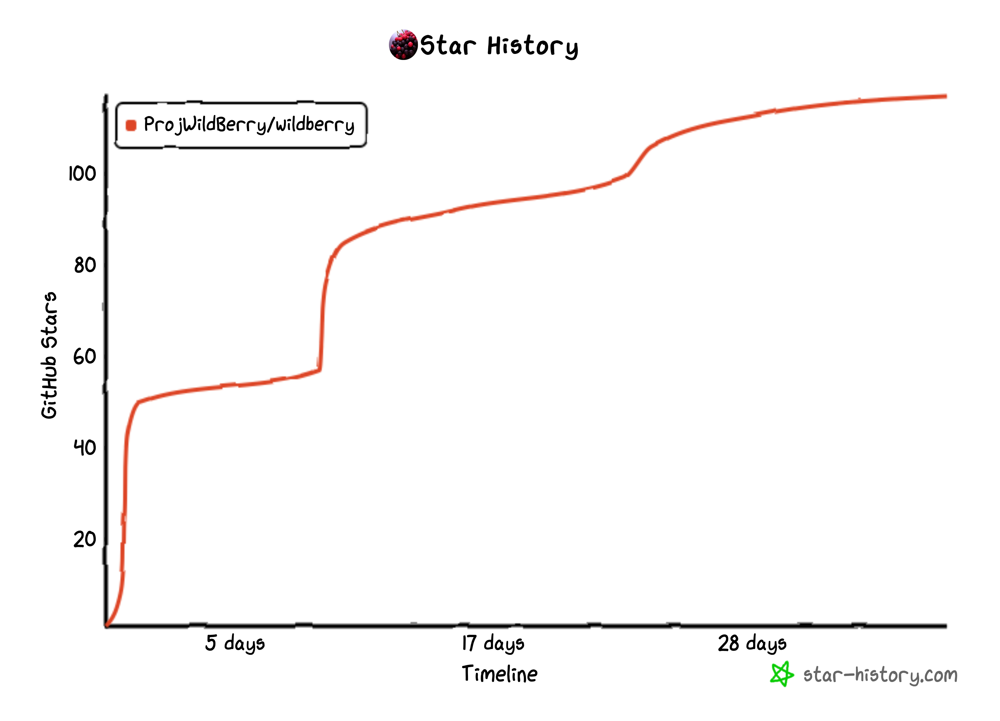

# Wildberry


A modern in-app purchase and subscription management system built with React and TypeScript.

Join our community:  
<a href="https://discord.gg/TfXNmjN54b"></a>

---
## Quick Start


### Deploy Instantly
[](https://heroku.com/deploy?template=https://github.com/ProjWildBerry/wildberry)
[](https://vercel.com/import/git?s=https://github.com/ProjWildBerry/wildberry)

## Overview


Wildberry is your all-in-one solution for managing subscriptions and in-app purchases with ease. Featuring a sleek React frontend and a powerful TypeScript backend, it’s designed for developers who value simplicity and performance.

---

## Why Wildberry?

| **Feature**          | **Wildberry**          | **Others**            |
|----------------------|-----------------------|-----------------------|
| Setup                | One-script install    | Complex multi-step    |
| Frontend             | Modern React UI       | Outdated interfaces   |
| Backend              | TypeScript + PostgreSQL | Unreliable stacks    |
| Analytics            | Built-in insights     | Extra paid tools      |
| Cost                 | Open-source (FREE)    | Expensive licenses    |

---

## Quick Start

### One-Command Setup
Run this single script to set up everything:

```bash
curl -sSL https://raw.githubusercontent.com/ProjWildBerry/wildberry/main/setup.sh | bash
```

This will:
1. Clone the repository
2. Set up environment variables
3. Start all services with Docker

Access:
- Frontend: `http://localhost:3001`
- API: `http://localhost:3000`
- pgAdmin: `http://localhost:5050`

---

## Features

- **Simple Setup**: Get started in minutes
- **Subscription Management**: Handle products and entitlements effortlessly
- **Analytics**: Track revenue and user behavior
- **Secure**: JWT auth and API key support
- **Beautiful UI**: Responsive, modern, and mobile-friendly

---

### Star History


### Contributors
[](https://github.com/ProjWildBerry/wildberry/graphs/contributors)

## License

MIT License - see [LICENSE](./LICENSE) for details

